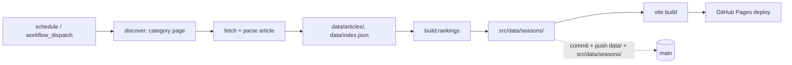

# Architecture Spine — NBA weekly power rankings

## Design Paradigm

Pipes-and-filters, matching the shape the repo already has. Each stage is a script that reads files and writes files; the filesystem is the interface, not a shared in-memory model.

```
discover (category page) -> fetch (article HTML) -> parse (-> data/articles/, data/index.json)
  -> rebuild (build-rankings.mjs -> src/data/seasons/) -> build (vite build) -> deploy (Pages)
```

All stages run inside one GitHub Actions job, triggered weekly and on manual dispatch. `scripts/` holds one file per pipeline stage, as it already does for `build-rankings.mjs` and `scrape-playoffs.mjs`.

## Invariants & Rules

### AD-1 — Weekly discovery checks the category page, records everything new

- **Binds:** the weekly scraper
- **Prevents:** a URL-guessing scraper silently drifting from NBA.com's actual slugs (renamed article, skipped week number); a scraper that filters out non-week specials and so disagrees with the existing index about what counts as "new"
- **Rule:** each run fetches `nba.com/news/category/power-rankings` and records every entry not already in `data/index.json` — article and index record alike — resolving each entry's own slug/URL. It never constructs a slug by incrementing a week number. This matches the existing index, which already carries non-week specials (offseason and playoff editions, `week: null`). AD-2's continuity check only tracks entries that have a week number; specials are recorded but don't affect it.

### AD-2 — Failure is gated by week continuity within the season window

- **Binds:** the weekly job's error handling
- **Prevents:** false alarms every off-season week; a real gap going unnoticed — including the case a plain "was a new article found?" check misses, where a failed run's gap is never caught because the *next* run's "newest article" is simply the following week, which still looks like success
- **Rule:** the job tracks the last week number it recorded per season. A run succeeds only if the newest in-season article found is the immediate next week (or a season's first week). Any other in-window outcome — no new article, or a jump of more than one week — fails the run. "In-window" is derived from the same per-season week-count data `build-rankings.mjs` already computes, not a separately invented date range. Outside that window (off-season, All-Star break), a missing or non-sequential article is a silent no-op. A failed run relies on GitHub Actions' default failure email — nothing else is built to notify.

  This narrows the brief's unconditional "fails loudly" line to the in-season window — a refinement decided during this architecture session; the brief's Weekly update section has been updated to match.

### AD-3 — Direct commit, no PR gate

- **Binds:** the weekly job
- **Prevents:** a review step creeping back in and breaking the zero-touch goal
- **Rule:** the job commits and pushes straight to `main`. No pull request is opened for the weekly data update.

### AD-4 — One workflow, cron plus manual dispatch, serialized

- **Binds:** all repo automation
- **Prevents:** a second, push-triggered workflow being added later that risks re-triggering itself off the weekly commit, the extra reasoning a two-workflow split would require, and a manual `workflow_dispatch` overlapping the scheduled run and racing it on the `git push` to `main`
- **Rule:** a single workflow file, triggered by `schedule` (weekly) and `workflow_dispatch`, runs discover → fetch → parse → rebuild → commit → build → deploy as one job. No workflow triggers on `push`. The workflow sets a `concurrency` group so an overlapping run queues instead of racing the push. Accepted trade-off: a manual code change doesn't go live until the next scheduled or manually-dispatched run.

### AD-5 — Playoffs scraping stays out of the automated job; the two scrapers own disjoint data

- **Binds:** the scope of the weekly job
- **Prevents:** scope creep into Basketball-Reference scraping, which has its own source and pacing rules; a future builder assuming the weekly job owns all of `data/`, when `scrape-playoffs.mjs` already separately owns `data/playoffs.json`
- **Rule:** `scripts/scrape-playoffs.mjs` stays a manual, separately-run script that owns `data/playoffs.json` only. The weekly job owns `data/articles/` and `data/index.json` only, and never touches `data/playoffs.json`.

### AD-6 — Article record shape and ownership [ADOPTED]

- **Binds:** the weekly scraper, `build-rankings.mjs`
- **Prevents:** the new scraper inventing a record shape incompatible with the existing data and build step
- **Rule:** the scraper writes the full record to `data/articles/<season>/<slug>.json` (same fields as existing records: `id`, `slug`, `url`, `title`, `shortTitle`, `excerpt`, `author`, `publishedAt`, `modifiedAt`, `season`, `week`, `hasStructuredRankings`, `rankings`, `rawText`) and a slim pointer (`id`, `slug`, `title`, `season`, `week`, `publishedAt`, `hasStructuredRankings`, `file`) into `data/index.json`. `npm run build:rankings` is the only thing that reduces these into `src/data/seasons/<season>.json`.

### AD-7 — Idempotent writes, keyed by slug; only the latest week is ever re-fetched

- **Binds:** the weekly scraper
- **Prevents:** a manual retrigger or a retried run duplicating or corrupting `data/index.json` or `data/articles/`; two builders disagreeing on whether a rerun should silently skip an already-recorded week or re-fetch and overwrite it
- **Rule:** every write is keyed by article slug. A rerun that finds the season's latest week already recorded re-fetches and overwrites it — NBA.com lightly edits articles post-publish, which is why `modifiedAt` exists separately from `publishedAt`. Any older week, once superseded by a later one, is immutable: the job never re-fetches it.

### AD-8 — Scraper politeness [ADOPTED]

- **Binds:** the weekly scraper
- **Prevents:** hitting nba.com in a way that looks like abuse
- **Rule:** space requests and set a descriptive user agent, the same convention `scripts/scrape-playoffs.mjs` already follows.

## Consistency Conventions

| Concern | Convention |
| --- | --- |
| Naming | Article identity is nba.com's own URL slug. Season keys are the existing `"YYYY-YY"` string. |
| Data & formats | Dates are ISO 8601 strings (`publishedAt`/`modifiedAt`). Teams are identified by numeric NBA `teamId`, mapped to a slug via the `TEAM_SLUGS` table hardcoded in `scripts/build-rankings.mjs` — reuse that table; don't source it from `src/Chart/teams.ts`, which has no `teamId` field. (Note: `scripts/scrape-playoffs.mjs` already derives a second, independent name-keyed mapping from `teams.ts`; the weekly scraper should not add a third.) |
| State & cross-cutting | The weekly job owns `data/articles/` and `data/index.json`; nothing else writes those two. `scrape-playoffs.mjs` separately owns `data/playoffs.json` (AD-5). `build:rankings`, run by the weekly job, is the only writer of `src/data/seasons/`. The job's `GITHUB_TOKEN` needs `contents: write` (commit) and `pages: write` + `id-token: write` (deploy). |

## Stack

| Name | Version |
| --- | --- |
| Node.js (CI) | 22.x — Maintenance LTS (Active LTS is Node 24; Vite 8 requires `^20.19.0 \|\| >=22.12.0`, so 22.x satisfies the floor) |
| actions/checkout | v7.0.1 |
| actions/setup-node | v7.0.0 |
| actions/configure-pages | v6.0.0 |
| actions/upload-pages-artifact | v5.0.0 |
| actions/deploy-pages | v5.0.1 |

Versions verified on GitHub on 2026-10-07; re-check before pinning if this spine is acted on much later.

## Structural Seed



The commit happens after the rebuild, not before it — it carries both the raw scraped data and the rebuilt `src/data/seasons/` files the deployed chart actually reads, matching the brief's "commits the result, so the deployed chart picks it up."

```text
scripts/
  scrape-weekly.mjs     # new: discover + fetch + parse, writes data/articles/ + data/index.json
  build-rankings.mjs     # existing: reduces data/ into src/data/seasons/
  scrape-playoffs.mjs    # existing: manual, untouched
.github/
  workflows/
    weekly-update.yml    # new: schedule + workflow_dispatch, runs the full pipeline
```

## Deferred

- **Vite `base` path for GitHub Pages.** The repo (`nathanemyers/nba-weekly-power-rankings`) is already known; this is just a config value for whoever wires up the deploy step, not a cross-unit invariant.
- **Custom domain.** The brief dropped the old `nathanemyers.com` URL; if a custom domain is added later, that's a DNS/Pages setting, not an architectural decision.
- **Exact per-season week-count source.** AD-2 requires reading each season's known week range; wiring that lookup (e.g. exposing `build-rankings.mjs`'s per-season `maxWeek` for reuse) is an implementation detail, not fixed here.
- **Arcs-to-watch feature.** Out of this spine's scope (pipeline + hosting only). The brief requires its rolling-window climb/fall thresholds to be kept as tunable settings, not hard-coded — carried forward as a requirement for whoever architects or builds that feature next, not resolved here.
